# Unscented Kalman Filters

The UKF is an alternative technique to deal norming your process models or nonlinear measurement models. But instead of linearizing a nonlinear function, the UKF uses so-called **sigma points** to approximate the probability distribution.

This has two advantages. In many cases the sigma points approximate the nonlinear transition better than a linearization does. Also it is not necessary to calculate Jacobian matrix.

## What problem does the UKF solve?
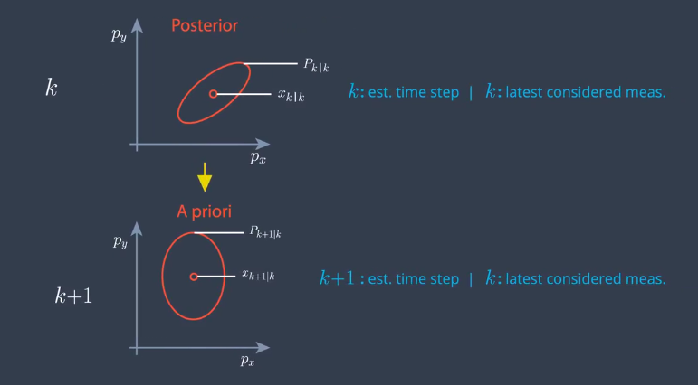
To deal with nonlinear functions, the UKF uses the unscented transformation. Let's start again from the point where we have the **state vector mean** x and the **state covariance** P a time step k. What we want to do is predict the mean and the covariance to time step k+1.

k pipe k means the estimation is for time step k, and the measurement at time k has already been taken into account.This is also called the posterior estimation.

k+1 pipe k means the estimation if for time k+1 but the last measurement that has been taken into account was from k. This is exactly what we have after the prediction. And this is also called the a priori estimation. 

Now, what do these ellipses mean? Theay visualize the distribution of our uncertainty.All points on this line have the same probability density. If the uncertainty is normally distributed, these points have the shape of a ellipse. It is often called error ellipse.

- If the process model is linear
The prediction problem looks like this. Q is the covariance matrix of the process noise. We can use the Kalman filter to solve this linear prediction problem.

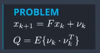

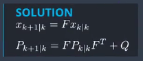

- If the process model is nonlinear
Then the prediction is defined by a nonlinear function, f as we've just derived it for the CTRV model. Predicting with a nonlinear function provides a distribution which is generally **not normally distributed anymore**. Actually it's not so easy to calculate this predicted distribution.

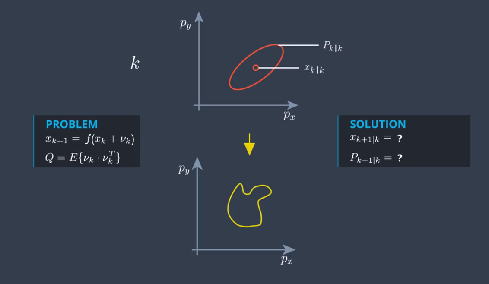

**What the UKF does** is keep going as if the prediction was still normally distributed. This is not an analytical path anymore. Of course, it is an approximation. What we want to find now is the normal distribution that represents the real predicted distribution as close as possible.

So what we are looking for is the normal distribution that has the same mean value and the same covariance matrix as the real predicted distribution.

## Unscented Transformation
The unscented transformation solves this problem using sigma points. It can be difficult to transform the whole state distribution through a nonlinear function. **But it is very easy to transform indibidual points of the state space** through the non-linear function, and this is what sigma points are for.

The sigma points are chosen around the mean state and **in a certain relation to the standard deviation signal** of every state dimension. This is why these points are called sigma points. This serve as representatives of the whole distribution. This will not provide the same mean and covariance as the real predicted distribution. But in many cases, it gives a useful approximation.

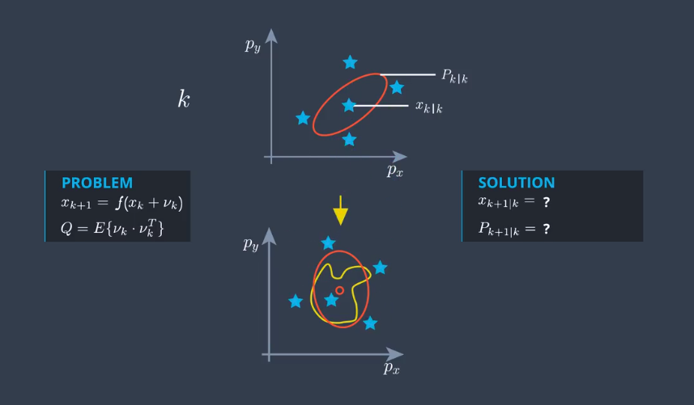

Once you have chosen the sigma points, you just insert every single sigma point into the nonlinear function f. So theay will come out somewhere here in the predictive state space.

This is the sigma point from my program.
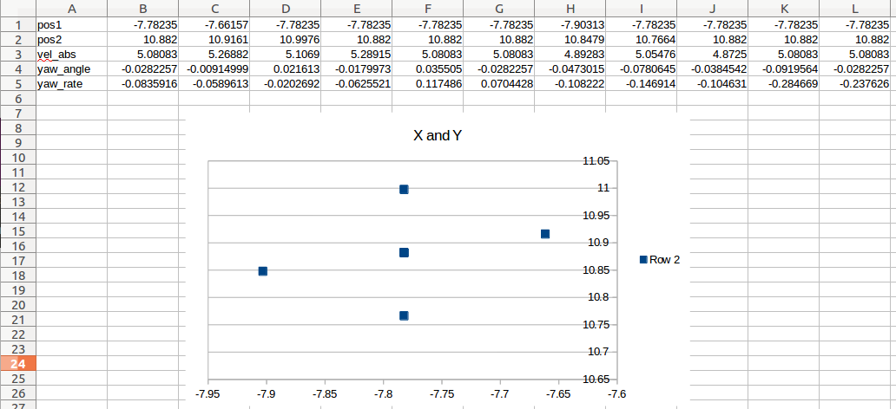

## CTRV Model
In the EKF(Extended Kalman Filter)Project, we used a process model with constant velocity. However, with the assumption that the velocity is constant you're simplifying the way vehicles actually moves because most roads has turns.
But this is the problem because a process model with assumption of constant velocity and direction will predict turning vehicles incorrectly.
The model we will use from now on assumes objects can move straight, but they can also move with a constant turn rate and a constant velocity magnitude. This model is often called the CTRV model(Constant Turn Rate and Velocity Magnitude Model)

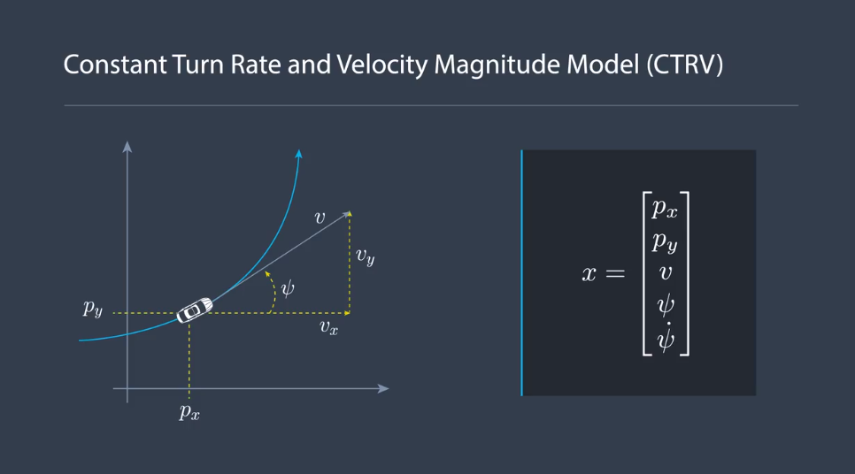

Instead of describing the velocity with vx and vy, we use the speed and yaw angle. The speed is the magnitude of the velocity, which we'll call V. And the yaw angle is the orientation, which we'll call psi. Since we also wang to be able to estimate the yaw rate psi dot,

## Spaces using in the project
1) CTRV space (5)
[px, py, v, rho, rho-dot]
2) lidar measurement space (2)
[px, py]
3) radar measurement space
[r, phi, r_dot]


- ProcessMeasurement
 - initialize `x_` `P_`
 - Prediction
 - UpdateLidar or UpdateRadar

## RMSE
RMSE(root-mean-square-error),is the square root of the average of squared errors.

`estimations`,`ground_truth` are vector type data from `vector` library. They contain every cycle of the estimations and ground truth data. The 

And the RMSE is the square root of the average of squared errors of every cycle.

## State vector and Logging data
### EKF(constant v model)
EKF(Extended Kalman filter) for trace a bike position, state vector x
x(0) : px
x(1) : py
x(2) : vx
x(3) : vy

logdata (14 variables):
cycleNumber, ekf.x(0) , ekf.x(1) , ekf.x(2) , ekf.x(3) , raw_measurements(0) , raw_measurements(1) , gt_values(0) , gt_values(1) , gt_values(2) , gt_values(3) , gt_values(4) , RMSE(0) , RMSE(1) , RMSE(2) , RMSE(3) 

### UKF(CTRV model)
(Unsented Kalman filter) for trace a bike position , CTRV model(constant turn rate and velocity magnitude model)
state vector:
pos1 , pos2 , vel_abs , yaw_angle , yaw_rate 

logdata (17 variables)
cycleNumber, ekf.x(0) , ekf.x(1) , ekf.x(2) , ekf.x(3) , raw_measurements(0) , raw_measurements(1) , gt_values(0) , gt_values(1) , gt_values(2) , gt_values(3) , gt_values(4) , RMSE(0) , RMSE(1) , RMSE(2) , RMSE(3) , NIS_laser , NIS_radar

## Tune noise parameters
Consistency
###NIS(Normalized innovation squared)
At every time cycle, we calculate the measurement prediction zk+1 pipe k and the covariance matrix S of this prediction. Then we receive the actual measurement zk + 1 for that time step.

## PROJECT DESCRIPTION
The project "unscented Kalman filter" is based on the same structure as the extended Kalman filter.
It uses a main file that calls a function called ProcessMeasurement. Anything important happens in this function. The function is part of the class ukf.


## Cholesky decomposition
In linear algebra, the Cholesky decomposition or Cholesky  is a decomposition of a Hermitian, positive-definite matrix into the product of a lower triangular matrix and its conjugate transpose.

Reference
wiki
https://en.wikipedia.org/wiki/Cholesky_decomposition
MATLAB
https://www.mathworks.com/help/matlab/ref/chol.html?s_tid=gn_loc_drop#responsive_offcanvas
Cplusplus
https://eigen.tuxfamily.org/dox/classEigen_1_1LLT.html

## Analyze Program

### main

### UKF
UKF share variables
**use_laser** //use laser measurements
**use_radar** //use radar measurements
**x_** // VectorXd(5), initial state vector
**p_** // MatrixXd(5,5), initial covariance matrix
**std_a** // noise longitudinal acceleration in m/s^2, need to be tune
**std_yawdd** // noise yaw acceleration in rad/s^2, need to be tune
**n_x = 5** // state dimension
**n_aug = 7** // Augmented state dimension
**lambda_** // Sigma point spreading parameter
**Xsig_pred** // predicted sigma points matrix, (5,15)
**weights** // weights of sigma points
**NIS_radar** // current NIS(Normalized innovation squared) for radar
**** // current NIS(Normalized innovation squared) for laser

### ProcessMeasurement
**ro** //radar measurement value
**phi** //radar measurement value
**ro_dot** //radar measurement value
**dt** // time diffrence in us

### Prediction
**Xsig** //sigma point matrix (5,11)
**A** // square root of P, using Cholesky decomposition
**X_aug** // augmented mean vector(7)
**P_aug** // augmented state covariace (7,7)
**Xsig_aug** // sigma point matrix (7,15)
**lambda_** // lamda for augmented sigma points, 3 - n_aug = -4

//state values for better readability
p_x, p_y, v, yaw, yawd, nu_a, nu_yawdd 

//predicted state values
px_p, py_p, v_p, yaw_p, yawd_p

### UpdateLidar
**z** //measurement vector 
**n_z** // = 2
**Zsig** //sigma points in measurement space (2, 15)
**S** //measurement covariance matrix (2,2)
**Tc** // cross correlation, (2,2)
**K** // Kalman gain

### UpdateRadar
**z** //measurement vector
**n_z** // = 3
**Zsig** //sigma points in measurement space (3, 15)
**S** //measurement covariance matrix (3,3)
**Tc** //cross correlation, (3,3)
**K** // Kalman gain


### program sequence
- Prediction
 - Generate Sigma points
 
 - Augment sigma points
 
 - 

In this video I would like to discuss with you, how to choose noise parameters and how to evaluate this choice. This is not only related to the unscented Kalman filter, but it can be applied to any Bayesian filter.
When we talked about our process and our measurement models, we introduced several sources of uncertainty. In the process model, we introduced the process noise noise nu k.
In the process model, we introduced the process noise nu k. And in the measurement model, we introduced the measurement noise omega k. In case of a radar measurement, this was the noise of the distance measurement, rho, the angle measurement phi, and the radial velocity rho dot.

We also quantified the noise with the process noise covariance matrix and the measurement noise covariance matrix. And they quantify how strong the noise is.

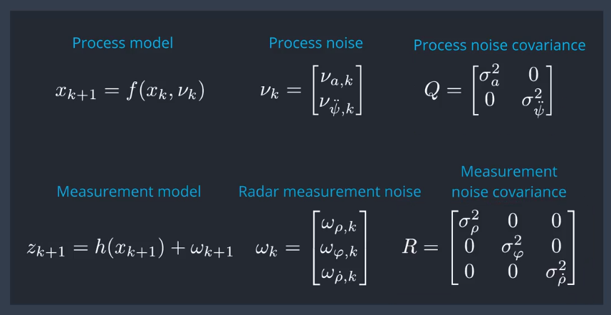

But we haven't discussed where we get these values from. Let's start with the measurement noise. This noise describes how precise the sensor can measure. It means we have to look into the sensor manual and see how precise the sensor is.

For example, we might read the radar can measure the distance rho , with the standard deviation of  0.3 meters. This means we know the value for the variance sigma rho squared, which is 0.09 meters squared.

```
  NIS_radar_ = z_diff.transpose() * S.inverse() * z_diff; //z_diff(3x1) S.inverse (3x3) z_diff.transpose(1x3)
```
The innovation is the difference between the predicted measurement and the actual measurement. And normalized means you put it into relation to the covariance matrix S.
That's why you have the inverse of the matrix S here. 
The NIS is just a scalar number and super easy to calculate. But you need to know what number to expect. For that, you need to know something about the statistics of this NIS. 

### Chi-squared distribution
The NIS value follows a distribution which is called chi-squared distribution. If you Google chi-squared distribution, you will find a table like this. And this table tells you the number you should expect for your NIS.

Let's find the right number for our example. DF means degrees of freedom. That's the dimension of our measurement space. We have a three-dimensional radar measurement. So we have three degrees of freedom. So what do all these numbers mean? 0.95 says statistically, in 95% of all cases, your NIS will be higher than 0.352. And this colume says in 5% of al cases your NIS will be higher than 7.815. Let's remenber this number, 7.8.
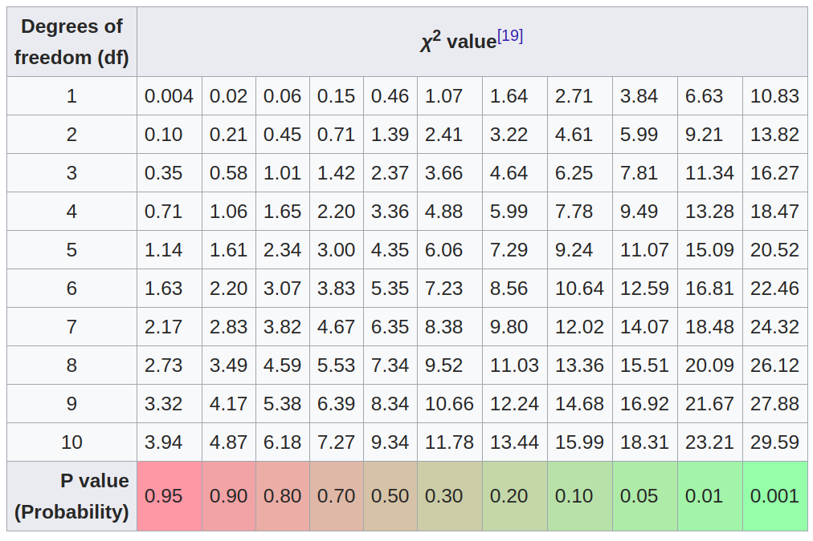

Reference:
https://en.wikipedia.org/wiki/Chi-squared_distribution


What you can always do when you design a filter is plot the 95% line. In our case, that's 7.8. And then for every time step k, calculate and plot also the NIS value. If you see something like this, then everything looks great. Sometimes you are over the 95% line, but that's what we expect.
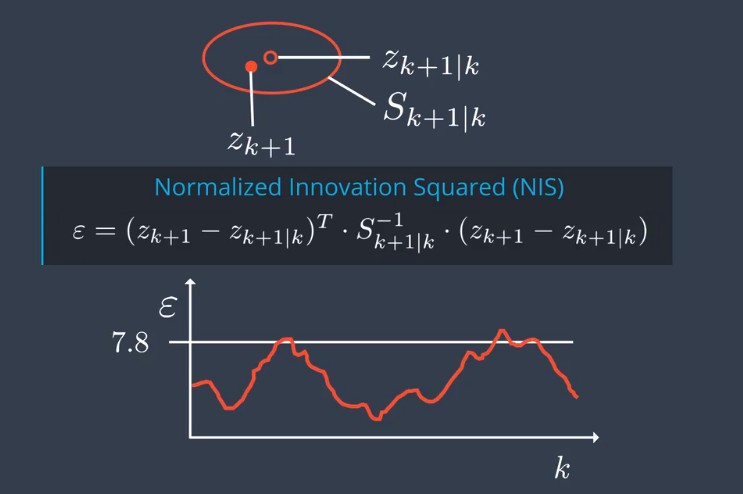

If you see something like this, it means you underestimate the uncertainty in your system, like in the example we saw before.
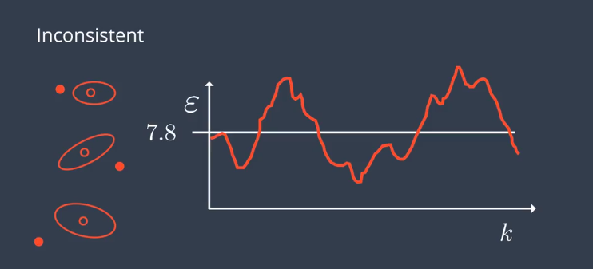

If you see someting like this, it means you overestimate the uncertainty in your system. Your estimations are actually more precise than you think.
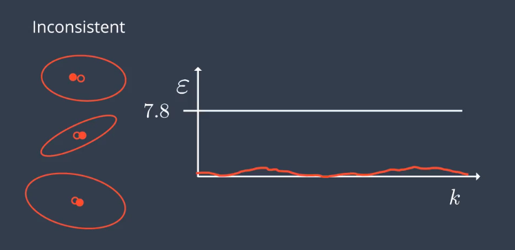

Unfortunately, the NIS test does not tell you where the mistake comes from, but it gives you at least some feedback.